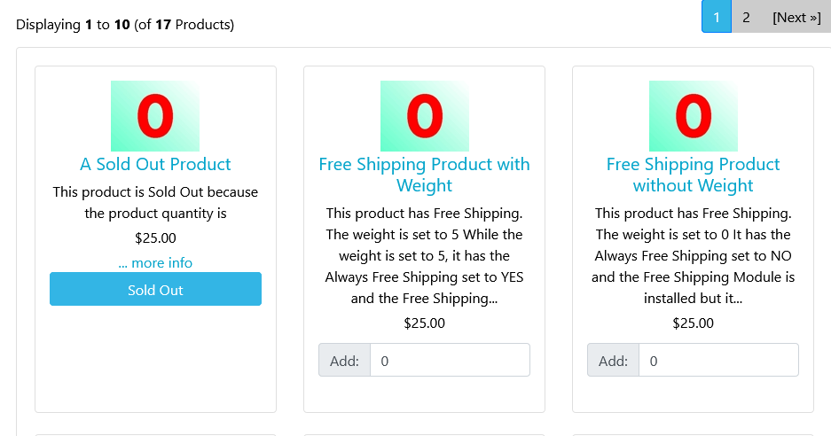
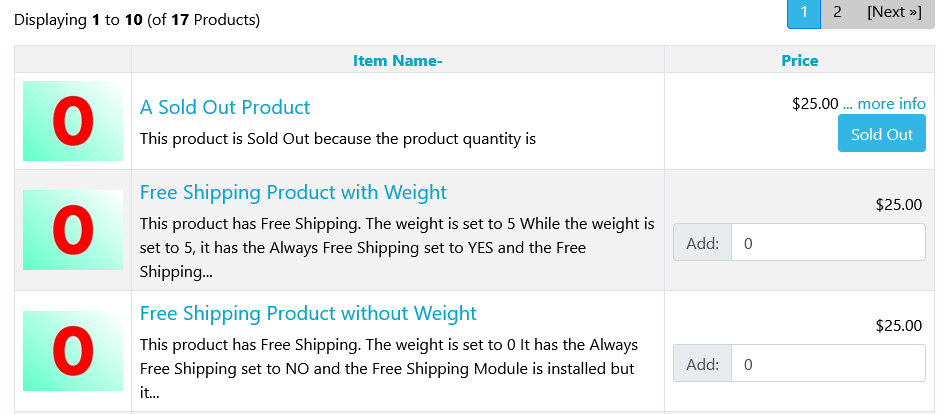
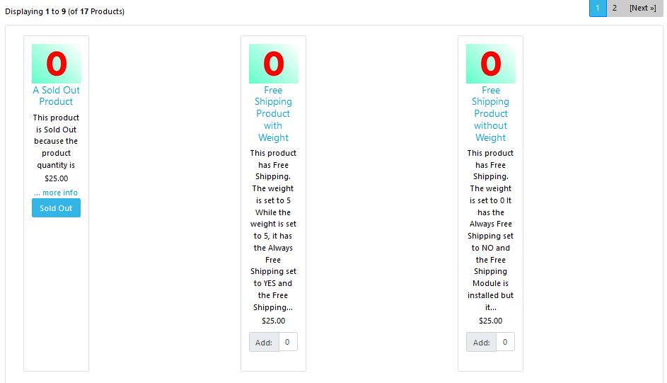

# Bootstrap-4 Template FAQs

## Troubleshooting

### Configuration :: Product Listing :: Columns per row, display anomalies

The Bootstrap template supports two values for the configuration setting `Product Listing :: Columns per row`:

| Value | How it works                                                 |
| :---: | ------------------------------------------------------------ |
|   0   | Uses the Bootstrap CSS rules to format columns.  This is the recommended setting for the Bootstrap template. |
|   1   | Displays the products' listing in a row-based manner         |
|  2+   | Forces the specified number of columns by manually calculating a percentage.  This cannot take into account all the other styling associated with the listing |

Here's how the display looks using the demo products with various settings:

#### Columns per row = 0

#### Columns per row = 1

#### Columns per row = 3

