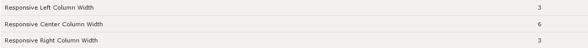

# Bootstrap-4 Template FAQs

## Troubleshooting

### Configuration :: Product Listing :: Columns per row, display anomalies

The Bootstrap template supports two values for the configuration setting `Product Listing :: Columns per row`:

| Value | How it works                                                 |
| :---: | ------------------------------------------------------------ |
|   0   | Uses the Bootstrap CSS rules to format columns in a `fluid` manner.  This is the recommended setting for the Bootstrap template. |
|   1   | Displays the products' listing in a row-based manner         |
|  2+   | Forces the specified number of columns by calculating a *fixed* percentage for **all** viewport widths.  This cannot take into account all the other styling associated with the listings and is not recommended. |

#### Controlling the Fluid Listing Layout

The template's `/includes/modules/bootstrap/product_listing.php` makes use of the Bootstrap-4 [Grid System](https://www.w3schools.com/bootstrap4/bootstrap_grid_basic.asp) to provide the `fluid` layout based on the screen (i.e. viewport) width and the currently configured *Center Column Width*.  The *Center Column Width* is determined using the template's *Responsive [Left|Center|Right] Column Width* settings. For template versions prior to v3.2.0, these settings are found in `Configuration :: Layout Settings`; starting with v3.2.0, the settings are now in `Configuration :: Bootstrap Template Settings`.



A page's *Center Column Width* is calculated by subtracting the sum of the left-column width and right-column width from `12` (the maximum number of bootstrap columns).  That calculation, provided by the template's `tpl_main_page.php`, takes into effect any page-specific side-box disables (`$flag_disable_left` and `$flag_disable_right`).

The `product_listing.php` module uses the *Center Column Width* to determine the bootstrap classes to apply to each product 'card' using a lookup array.  For v3.2.0, the default lookup array is

```php
            // this array is intentionally in reverse order, with largest index first
            $grid_classes_matrix = [
                '12' => 'row-cols-1 row-cols-sm-2 row-cols-md-3 row-cols-lg-4 row-cols-xl-6',
                '10' => 'row-cols-1 row-cols-md-2 row-cols-lg-4 row-cols-xl-5',
                '9' => 'row-cols-1 row-cols-md-3 row-cols-lg-4 row-cols-xl-5',
                '8' => 'row-cols-1 row-cols-md-2 row-cols-lg-3 row-cols-xl-4',
                '6' => 'row-cols-1 row-cols-md-2 row-cols-lg-2 row-cols-xl-3',
            ];
```

and can be customized, starting with v3.2.0 of the template, on a shop-by-shop basis by providing an override of the `$grid_classes_matrix` array, preferably in a .php file present in `/includes/extra_datafiles` .

#### Display Examples

Here's how the display looks using the demo products with various settings, using a `Responsive Center Box Width` of 6:

##### Columns per row = 0


##### Columns per row = 1


##### Columns per row = 3

